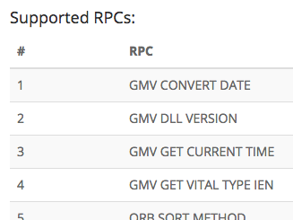
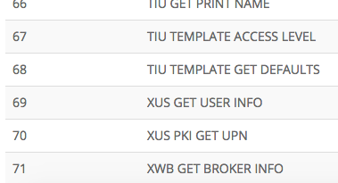
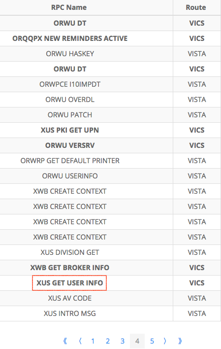
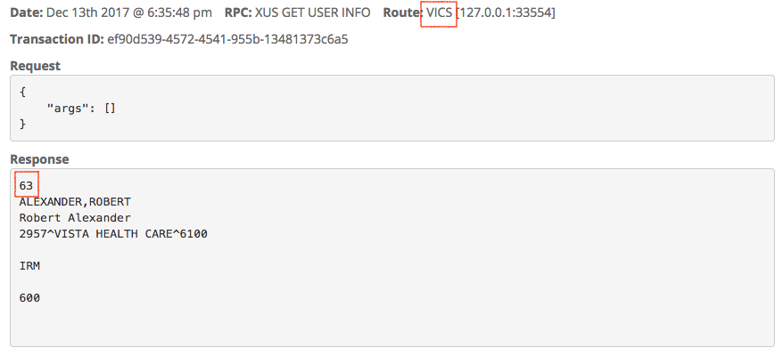
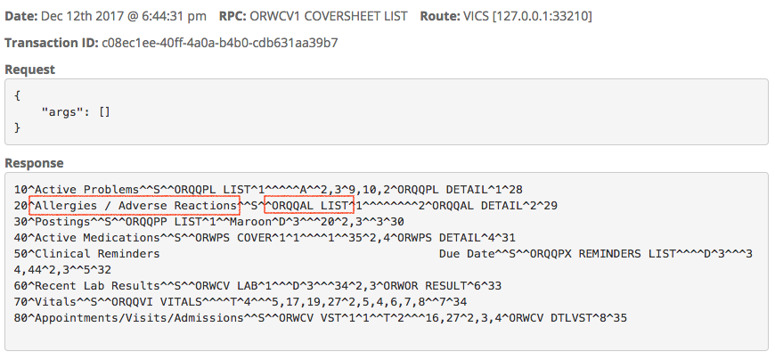
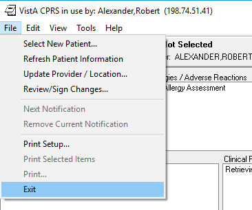
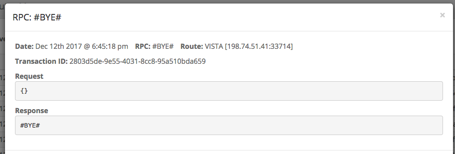

# VAM Demonstration Build 1 (December 2017)

The following demo illustrates the components of the _VAM Build 1_ release.


_VAM Build 1_ involves four components, a _VISTA_, a _VICS Server_, an _RPC Router_ and a _CPRS Client_. The first three are hosted on a cloud-based VM at _vamdemo.vistadataproject.info_. You must install and run _CPRS_ from your local machine.

Start by opening your browser and opening the _RPC Router Manager_ at _[http://vamdemo.vistadataproject.info:9012](http://vamdemo.vistadataproject.info:9012)_. This client let's you monitor RPC traffic sent by _CPRS_ ...


It opens to an empty _RPC Events_ tab which lists the RPCs dispatched through Router. The _Route_ column shows which RPCs go to _VISTA_ and which go to the _VICS Server_. 

Click on the _Management_ tab. The first thing you see is a toggle for controlling whether supported RPCs are routed to the _VICS Server_ or sent to VISTA. 


It defaults to _On_ which means the Server will receive any RPC it supports. The second part of the Management tab lists the RPCs supported by the Server ...



This list is fetched from the Server by the Router using a custom RPC. As Server coverage grows with each VAM release, the Router will send more and more traffic its way. In _Build 1_, the Server supports _71 VISTA RPCs_ ...



Now, switch back to the _RPC Events_ tab and start _CPRS_ ...


CPRS should be connected to _vamdemo.vistadataproject.info:9011_. After connecting CPRS presents a login screen ...


Back in the _Router Manager_, the _RPC Events_ tab shows the three RPCs sent by CPRS, all of which were routed to VISTA ...


Double click on the row with the _XUS INTRO_ RPC ...


This, like all detail popups, shows four key aspects of an RPC monitored by the Router:
  1. When the RPC was received and where it was routed to. This RPC was routed to _VISTA_.
  2. A unique transaction id is given to every RPC received by the Router. This id allows RPC traffic to be identified uniquely in audit logs.
  3. The arguments passed in a request
  4. The response from either VISTA or the VICS Server 

Now briefly go back to CPRS and login as Dr Robert Alexander using the following credentials ...

```
   Access Code: fakedoc1
   Verify Code: 1doc!@#$
```

Back in the _Router Manager_, RPC after RPC cascades through the _RPC Event_ tab. CPRS is very "chatty" - Before any patient is selected, it sends over 80 RPCs. RPCs supported by the _VICS Server_ go to the server, not VISTA. As the Server emulates CPRS' RPC interface, CPRS proceeds as if all of its interactions are with the VISTA ...



Note that even before patient selection, CPRS has sent five pages of RPCs, some handled in _VISTA_, some in the _VICS Server_. _ORWU DT_ is sent more than once by CPRS - CPRS asks for the date many many times ...


which is now handled by the VICS Server's _Time Service_.

The RPC, _XUS GET USER INFO_ is highlighted in red. Clicking on that row of the table brings up its details ...



Unlike _XUS INTRO DETAILS_, this RPC was handled by the _VICS Server_ and not by _VISTA_. The server's _User Service_ knows about all the users of _VISTA_ - it is designed to manage the user's of all _130 VISTAs_ across the VA. 

Back in CPRS, you are asked to select a Patient ...


Single Click on _Carter, David_. You'll see that this patient's demographics appear to the left of the selection box ...


The Router Manager shows this information comes from three RPC calls ...


mainly from ...


As the image above shows, in Build1, this RPC continues to be processed by VISTA in _Build 1_ - unlike user information, patient data is not yet in the VICS Server. It will migrate in _Build 2_.

Clicking _Ok_ will bring you to the Patient's Chart ...


and fill two more tabs of RPCs from VistA ..


one of which is the VICS Server-supported _ORWCV1 COVERSHEET LIST_ ...



an RPC that tells CPRS what to show. Just like VISTA, the VICS Server supports different coversheet configurations for different users but now the settings are maintained nationally in one place, in a _Parameter Service_. Such centralization of preferences, permissions and settings is key feature of VICS.

__TODO__: go through any Allergy, Problem, Vital called in this first sequence up to coversheet.

Finally, when you exit from CPRS ...



the _Router Manager_ will show the RPC sign out messages ending in _BYE_ ...



Once CPRS disconnects, the Router will close its connection to both VISTA and the VICS Server.
