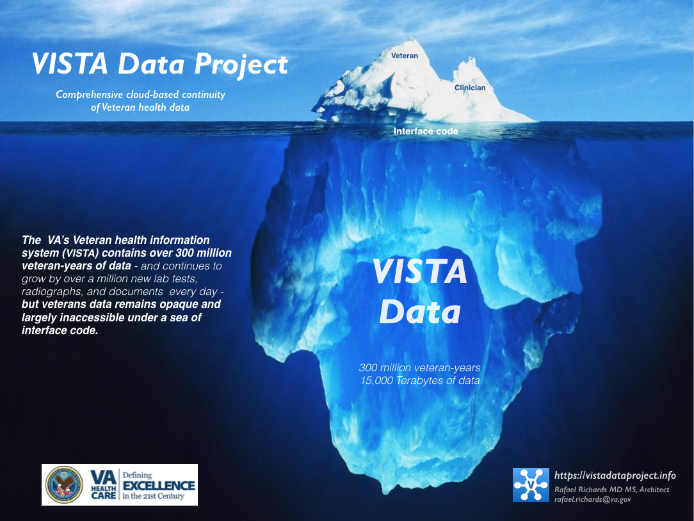

### VISTA Data Project

The Veterans Information Systems Technology Architecture ([VISTA](https://en.wikipedia.org/wiki/VistA)) is the U.S. Department of Veterans Affairs integrated longitudinal  clinical, business, and administrative information system that supports the operations of the 1200+ Veterans Health Administration (VHA) hospitals and clinics across the United States. (See: [VISTA Background](https://github.com/vistadataproject/documents/tree/master/Background/vista)).

The 130 VISTA systems in operation today contain over three hundred million veteran-years of health data, and continue to grow at the rate of over a million new clinical documents, lab tests, and radiographs each day. Federal policy mandates the __veterans complete electronic health record must be available in digital form for 75 years__. (see [VHA Records Control Schedule](https://www.va.gov/vhapublications/rcs10/rcs10-1.pdf),Section 6000.2b). It thus necessary to assure modern, comprehensive access to VISTA's data to provide continuity of veteran care now, and for decades into the future.  

VISTA's data, however, remains uniquely defined, opaque, and challenging to access under thousands of undocumented legacy code interfaces in each of these distinct systems.  VISTA's internal operational data model - the roadmap to all of VA's institutional, business, and clinical processes and data - has evolved organically within each system over the past 35 years, but has not been exposed and represented in modern, computable form.  

*__In the VISTA Data Project__*,  *VISTA's* native operatonal clinical and business model is comprehensively exposed, enriched, and operationalized using a modern, computable, web-standard data model. This *VISTA Data Model* is in turn normalized across all *VISTA* systems to create a national, normalized Master Veteran Data Model, which provides secure read-write transactions across all *VISTA* systems using a single model-driven services interface.

*The figure above summarizes the evolution of access to VISTA data: From __thousands of unique, inconsistent, insecure, unidirectional, cryptic legacy code-based interfaces__ to that of a __single, secure, modern, service-based, industry-standard, normalized, master veteran data-model (MVDM)-driven interface__.*    For complete documentation on the VISTA Data Project, [click here](https://github.com/vistadataproject/documents/tree/master/Background#vista-data-project)

### VISTA Data ... Ready for the Cloud

Leveraging the Master Veteran Data Model (MVDM, above), the VISTA Adaptive Maintenance project provides a cloud-based roadmap and software for maintaining VISTA and the VA workflows it supports using web-standard, model-driven, commercial cloud services and microservices.  For information on VISTA Cloud Services, see [VISTA Adaptive Maintenance](http://vistaadaptivemaintenance.info/)

