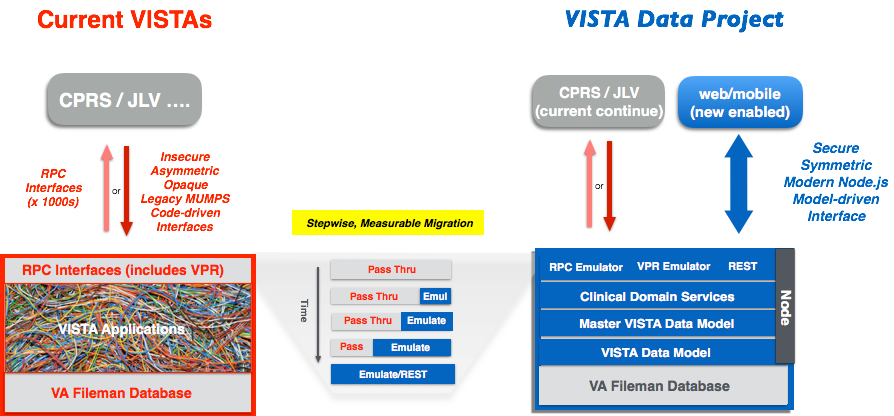

# VISTA Data Project

The Veterans Information Systems Technology Architecture ([VISTA](https://en.wikipedia.org/wiki/VistA)) is the U.S. Department of Veterans Affairs integrated longitudinal  clinical, business, and administrative information system. 130 instances support the operations of over 1200 VA hospitals and clinics nationwide.  

VISTA's data model - the roadmap to all of VA's institutional, business, and clinical processes and data - has evolved organically over the past 35 years, but has not been surfaced and leveraged in computable form - until now. 

In the VISTA Data Project (VDP), this VISTA Data Model (VDM) is comprehensively represented and then normalized to produce a national, standardized Master Veteran Data Model (MVDM). An operationalized MVDM provides new web clients with a single, secure, symmetric read-write interface for every VISTA and through _emulation_ of existing interfaces, VISTA clients such as CPRS run unchanged but with greatly enhanced security. 

 

__Strategic Benefits__:
  * New, maintainable veteran care server based on mainstream technology
  * New web and mobile clients enabled with mainstream technology
  * Current clients (CPRS/JLV) supported and enforce VA Care coverage
  * May now safely incrementally retire legacy MUMPS VISTA [spaghetti]
  * (Some) Clinical Domain Services may be implemented over COTS

 

MVDM runs inside VISTA replacing a spaghetti of MUMPS. It turns VISTA into a modular, model-based, backward-compatible server ...

 

In _VDP_, Data Modeling starts with 100% coverage of all VISTA data in web-standard JSON and moves up to a normalized master model for the functionality used by CPRS, VISTA's client, and provides new web clients with a modern, symmetric (read and write share the same data format), read-write interface ...

 

VISTA currently has a variety of overlapping security (access control and auditing) mechanisms including FileMan permissions and permission to invoke this or that remote procedure call (RPC). MVDM introduces comprehensive patient-centric security, industry standard attribute-based access control (ABAC) and tiered auditing to VISTA for the first time ...

 
 
__Show Me:__ browse through and run VDP's [Clinical](/demo) and [Non Clinical](/demo2) Demos.

