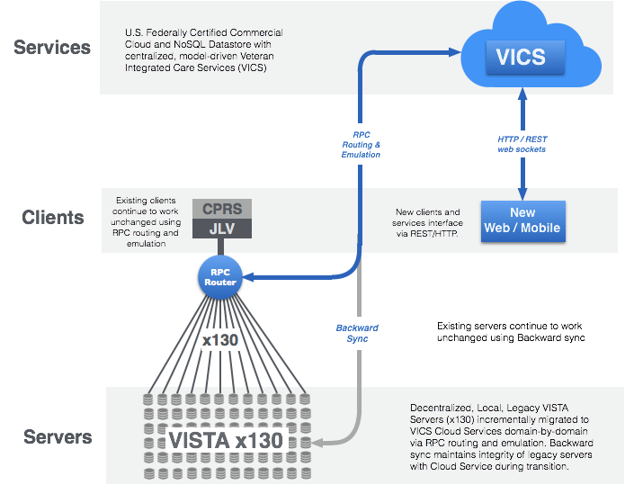
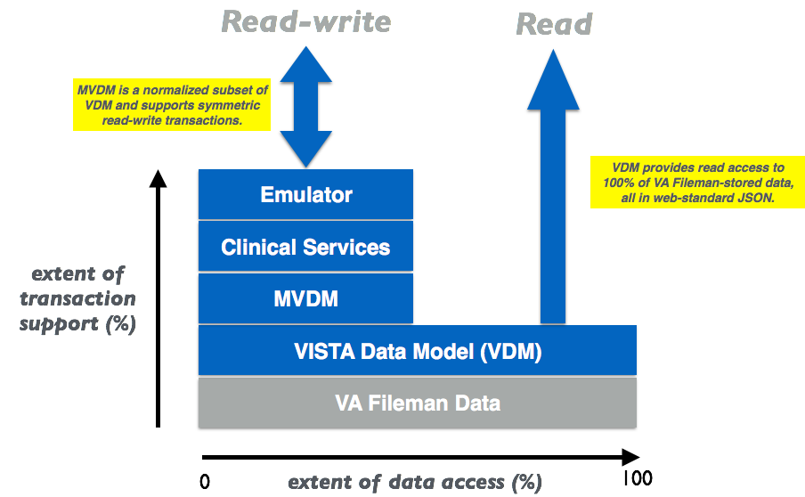
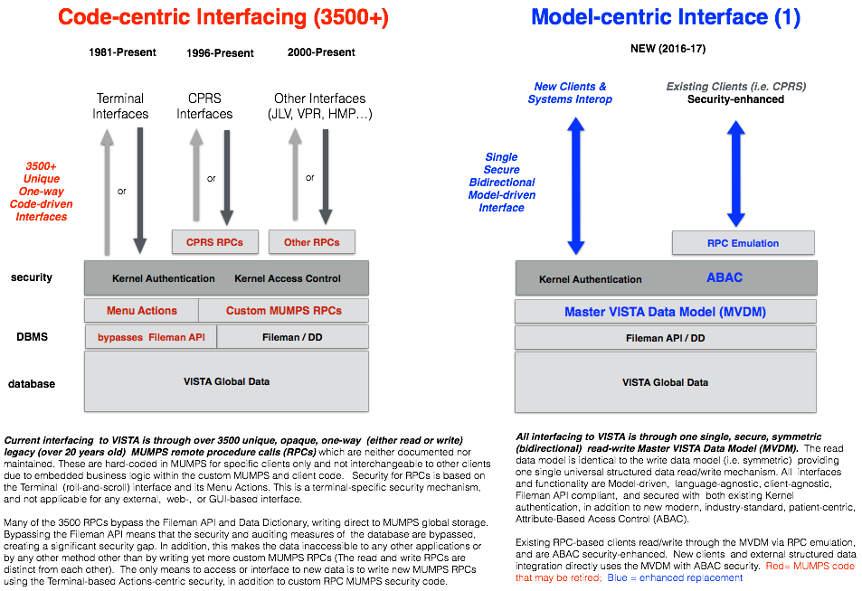

The Veterans Information Systems Technology Architecture ([VISTA](https://en.wikipedia.org/wiki/VistA)) is the U.S. Department of Veterans Affairs integrated longitudinal  clinical, business, and administrative information system. 130 instances support the operations of over 1700 VA hospitals and clinics nationwide.  

VISTA's data model - the roadmap to all of VA's institutional, business, and clinical processes and data - has evolved organically over the past 35 years but has not been surfaced and leveraged in computable form. Until now. 

In the VISTA Data Project (VDP), this organic data model is comprehensively represented and incrementally normalized across all VISTA systems to produce a national, standardized Master VISTA Data Model (MVDM). An operationalized MVDM provides new web clients with a single, secure, symmetric read-write interface to every VISTA and, through _emulation_ of existing interfaces, VISTA's current clients such as CPRS and JLV work unchanged, but with greatly enhanced security.  

Through this same MVDM-driven mechanism and emulation, VISTA functionality is incrementally migrated to a single national, cloud-based, veteran-specific Veteran Integrated Care Service (VICS),  allowing  the corresponding functionality of the decentralized VISTA systems to be deprecated while maintaining seamless continuity of care and services to veterans.

 

__Strategic Benefits__:

  * New, maintainable, centralized, cloud-based veteran care services based on mainstream technology
  * New web and mobile clients enabled with mainstream technology
  * Current clients (CPRS/JLV) supported and secured, enforcing continuity of VA Care coverage
  * May now safely incrementally retire legacy MUMPS VISTA systems
  * May now implement generic COTS clinical systems, while preserving veteran-specific care and services

 

__Show Me:__ browse through and run VDP's [Clinical](/demo) and [Non Clinical](/demo2) Demos.

 

# VDP Technology Stack

MVDM runs inside VISTA, replacing a spaghetti of MUMPS. It turns VISTA into a modular, model-based, backward-compatible server ...

 

# VDP Data Coverage

_VDP_ provides 100% coverage of all VISTA data in web-standard JSON and, step by step, is building out a normalized master model for the functionality used by CPRS and other VISTA clients ...

 

# VDP Security Enhancement

VISTA currently has a variety of overlapping security (access control and auditing) mechanisms including FileMan and Remote Procedure Call (RPC) permissions. MVDM introduces comprehensive patient-centric security, industry standard attribute-based access control (ABAC) and tiered auditing to VISTA for the first time ...

 
 

