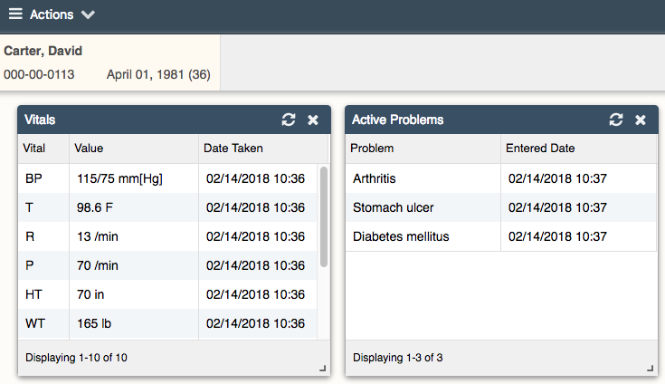

# _Build Web 1_ Demo (February 15th, 2018)

The following demonstrates [1] the basic functionality and layout of the _VICS Client_ and [2] shows basic CPRS interaction with the Web Client. 

It employs [a] a _"nodeVISTA"_ which supports a REST interface for Patient data access and entry, [b] a Web Service which implements basic meta-data services and proxies to _nodeVISTA_ for Patient Data, [c] the VICS Web Client and [d] CPRS. These components are housed on a cloud-based VM. 

Ultimately, the Web Client will cover all the relevant functionality of CPRS in a web-friendly form and deliver modern visual motifs and features missing from CPRS such as auto-complete in search dialogs and ease of personalization. This demonstration illustrates the functionality delivered in Build 1.

__INSERT DIAGRAM__

Specifically it shows how the client allows a Physician to:
  1. Choose a facility
  2. Choose a Patient and see basic demographics
  3. Add an additional widget (Vitals) to the coversheet
  4. View summaries of a Patient's Vitals, Allergies and Problems
  5. Enter a new Allergy
     * Search Allergins
     * Enter specific allergy information
  6. Review details of the entered Allergy
  7. Login to CPRS and view this newly entered Allergy
  8. Either:
     * Return to the Web Client and remove the Allergy by marking it as _entered in error_ OR
     * Remove the allergy in CPRS and then return to the Web Client and confirm the Allergy's removal

Start by selecting a user and facility ...

__Note__: the first builds of the Web Client will not support authentication. This should be addressed in the third and final build.

You will be asked to select a Patient ...

Despite the small list of patients here, enter "C" in the search box to narrow the list down to one.  Select that Patient and you will immediately see a summary of his information. This, like other behaviors in this client, mimics a similar behavior in CPRS ...

You will be a taken to a _Coversheet_ with widgets displaying different classes of Patient data ...

Let's add one more Widget, a Vitals widget ...

The added widget is now in the coversheet ...

The Web Client's Coversheet is a variation of the Coversheet seen in CPRS but is much easier to configure and rearrange by Physicians ...

__Note__: the current VICS Server persists a User's CPRS preferences. In the final build of the Web Client and VICS Server, a user's Web Client preferences will also be persisted.

Note how the Patient has no allergies ...

_Build 1_ of the Web Client let's you add one. Click on the _pencil_ icon on the title bar of the Allergy Widget and a popup will show which allows you to search for Allergins. It automatically searches once you've typed three or more letters ...

This _autocomplete_ means you don't need to explicitly click on a _Search_ button as you would have to in CPRS ...

This approach to search will be followed throughout the Web Client and will demand appropriate support from the meta data services of the VICS Server.

Back in the Web Client, choose Chocolate and press ok. The next window let's you fill in Allergy details ...

__Note__: Build 1 of the Web Client let's you enter _Historical_ Allergies. 

Back in the Coversheet, the Allergy Widget nows displays the newly entered Allergy ...

Click on this entry and a popup will appear with the details you just entered ...

The titlebar (in red above) has icons for printing and for marking the allergy as being _entered in error_. Clicking the _entered in error_ icon leads to a dialog where you can comment on the error and confirm you want the allergy removed ...

After you confirm removal, the Allergy Widget once again shows no active allergies ...

The Web Client is compatible with CPRS. Start CPRS right after Allergy Entry and you'll see ...

You can go on to mark that allergy as _entered in error_ ...

a removal that will be reflected in the Web Client. You just need to hit refresh in the title bar of the Allergy widget ...

__Note__: future releases of the client may support web sockets and event based updates.

